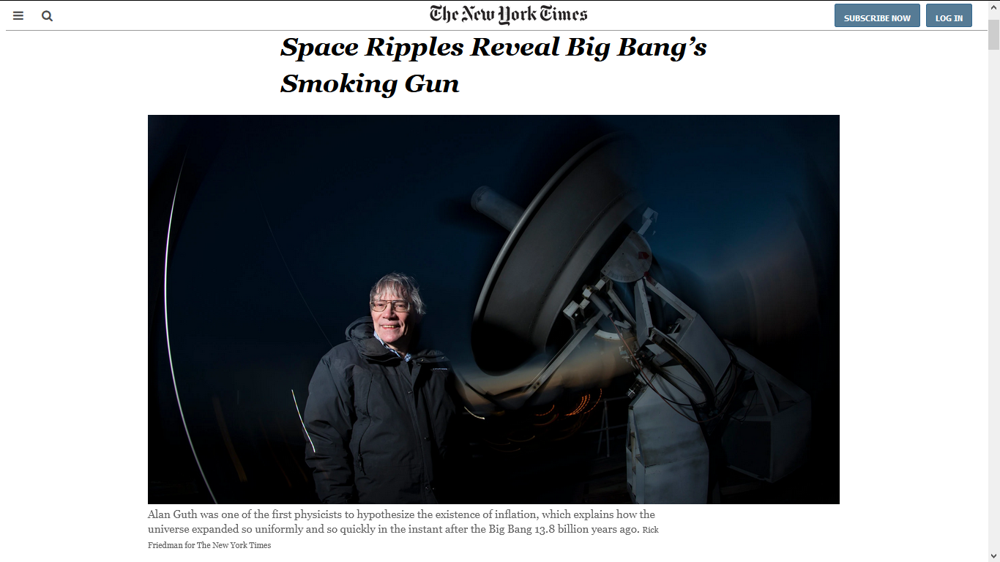

# Floating and Positioning Elements

Building an HTML and css page that matches the appearance of this page [NYT Space Ripples Reveal Big Bang’s Smoking Gun](https://www.nytimes.com/2014/03/18/science/space/detection-of-waves-in-space-buttresses-landmark-theory-of-big-bang.html?_r=0)

# Built With

- [HTML](https://developer.mozilla.org/en-US/docs/Web/HTML)
- [CSS](https://www.w3schools.com/css/)
- [Fontawesome](https://fontawesome.com/)

# Original Page

  

# Live Demo

[Click here for Live Demo](https://raw.githack.com/t-yanick/floating-and-positioning-elements/nyt-workplace/index.html)

# Getting Started

# Authors

### Jhonatan Sarrazola

- Github: @jssarrazolaa
- Twitter: [@ElTazoh](https://twitter.com/ElTazoh)
- Linkedin: [tazoh-yanick](https://linkedin.com/in/tazoh-yanick-5a978764)

### Tazoh Yanick Tazoh

- Github: [@t-yanick](https://github.com/t-yanick)
- Twitter: [@ElTazoh](https://twitter.com/ElTazoh)
- Linkedin: [tazoh-yanick](https://linkedin.com/in/tazoh-yanick-5a978764)

# Contributing

Contributions, issues and feature requests are welcome!
Feel free to check the [issues page](https://github.com/t-yanick/floating-and-positioning-elements/issues).

# Show your support

If you like our work, please give us a :+1:

# Acknowledgments

- Microverse
- W3schools
- Freecodecamp
- Developer.mozilla
- Learnshayhowe
- Odin project

# License

This project is [MIT](https://opensource.org/licenses/MIT) licensed.
